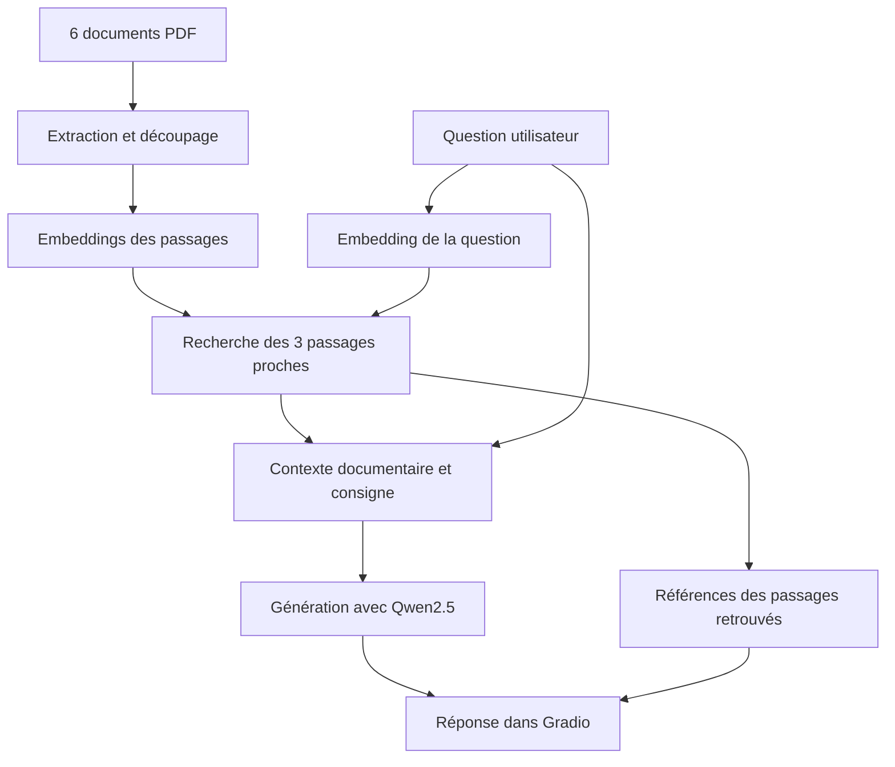

# Assistant documentaire RAG sur PDF

**Python · IA générative · Recherche sémantique · Gradio**

Prototype pédagogique présenté par **Jules APEDOH**, réalisé à partir de l’atelier guidé **Objectif IA de Machine Learnia** en septembre 2026.

Cet assistant répond à des questions sur une franchise fictive de salles de sport à partir de ses guides PDF. Il associe recherche de passages pertinents et génération de texte : une approche appelée **Retrieval-Augmented Generation (RAG)**.

## Le projet en quelques chiffres

| Élément | Configuration observée dans le notebook d’origine |
|---|---|
| Corpus | 6 PDF, 23 pages |
| Découpage | 167 passages ; taille cible de 500 caractères, chevauchement de 80 |
| Embeddings | MiniLM multilingue, 384 dimensions |
| Recherche | Similarité cosinus, 3 passages par question |
| Génération | Qwen2.5-1.5B-Instruct sur GPU |
| Interface | Gradio, avec lancement public temporaire enregistré |

Ces nombres décrivent le prototype et son corpus, pas une mesure de performance.

## Fonctionnement



Les références affichées permettent de retrouver les passages. Leur présence ne garantit pas que chaque affirmation de la réponse soit exacte.

## Compétences mobilisées dans l’atelier

- Extraction de texte PDF et préparation d’un corpus documentaire en Python.
- Compréhension du découpage avec chevauchement et des embeddings normalisés.
- Recherche sémantique avec Sentence Transformers et NumPy.
- Utilisation d’un modèle de langage préentraîné avec Hugging Face Transformers.
- Construction d’un contexte documentaire et comparaison qualitative des réponses.
- Exécution d’une interface de démonstration avec Gradio.

Le notebook est issu d’un **atelier guidé** : le socle de code, le corpus et la démarche sont fournis par Machine Learnia. Aucune contribution algorithmique originale ni aucun entraînement de modèle ne sont revendiqués. La préparation du dépôt et de sa documentation a été assistée par IA.

## Exécuter le notebook

### Option 1 — Google Colab

1. Télécharger [le notebook](notebooks/assistant_rag_pdf.ipynb), puis l’importer dans Colab.
2. Sélectionner un environnement GPU si disponible.
3. Exécuter toutes les cellules dans l’ordre. La première installe les dépendances.
4. Attendre le téléchargement des modèles, puis utiliser l’interface Gradio.

### Option 2 — En local

Prérequis : Python 3.10 ou supérieur, Internet et un espace suffisant pour télécharger les modèles, dont les poids du modèle 1.5B occupaient environ 3 Go dans l’exécution d’origine. Les besoins en mémoire dépassent la seule taille des poids. Le code sélectionne un modèle Qwen 0.5B si aucun GPU CUDA n’est disponible.

Depuis le dossier du projet :

```bash
python -m venv .venv
source .venv/bin/activate
python -m pip install -r requirements.txt
python -m jupyterlab notebooks/assistant_rag_pdf.ipynb
```

Sous PowerShell, remplacer la commande d’activation par `.venv\Scripts\Activate.ps1`.

Les dépendances ne sont pas verrouillées : le notebook fourni ne contient pas de relevé complet des versions installées. Une exécution complète de la version nettoyée et le gel des versions restent à faire. Les résultats enregistrés dans l’original sont documentés séparément et n’ont pas été présentés comme une nouvelle exécution.

## Essayer l’assistant

- « Combien coûte l’abonnement Premium au club de Marseille ? »
- « Le club de Lyon a-t-il une piscine ? »
- « Quel est le préavis pour résilier mon abonnement ? »
- « Quel est le cours du Bitcoin ? » pour explorer le comportement hors corpus.

Le notebook affiche les réponses et les références documentaires. Voir [les observations et limites](docs/resultats-et-limites.md).

## Contenu du dépôt

| Fichier | Rôle |
|---|---|
| [Notebook](notebooks/assistant_rag_pdf.ipynb) | Pipeline commenté, de l’extraction PDF à Gradio |
| [Dépendances](requirements.txt) | Bibliothèques nécessaires |
| [Résultats et limites](docs/resultats-et-limites.md) | Observations issues de l’original et pistes d’évaluation |
| [Origine et modifications](docs/provenance.md) | Attribution et modifications apportées pour ce dépôt |

## Limites et suites possibles

Ce projet est un prototype pédagogique. Il ne dispose ni d’un benchmark de fiabilité, ni d’un hébergement permanent. Les passages retrouvés peuvent mélanger plusieurs clubs ; la génération peut mal interpréter le contexte ou ignorer une consigne. La présence d’un PDF ne garantit pas que le passage nécessaire figure dans les trois résultats sélectionnés.

Les prochaines étapes seraient un jeu de questions avec réponses attendues, une mesure de la pertinence des passages, une meilleure gestion des villes et un test reproductible de l’environnement. Ces améliorations sont proposées, pas déjà réalisées.

## Crédits

- [Machine Learnia](https://www.machinelearnia.com/) : atelier Objectif IA, notebook initial et corpus fictif Club Odyssée.
- [Corpus de l’atelier sur Hugging Face](https://huggingface.co/datasets/Gui3/Atelier-Code-3-sep-25) : adresse utilisée dans le notebook fourni ; son nom contient « 25 », sans modification de ce chemin.
- [MiniLM multilingue](https://huggingface.co/sentence-transformers/paraphrase-multilingual-MiniLM-L12-v2) et [Qwen2.5-1.5B-Instruct](https://huggingface.co/Qwen/Qwen2.5-1.5B-Instruct) : modèles préentraînés utilisés.

Aucune nouvelle licence globale n’est attribuée au code ou aux documents tiers : leurs conditions d’origine restent applicables.
